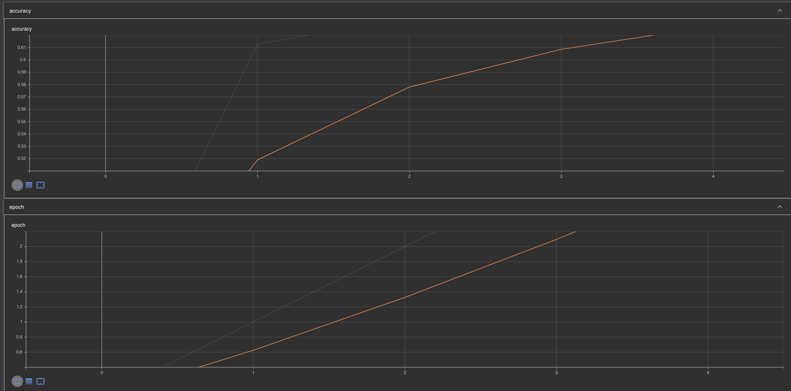
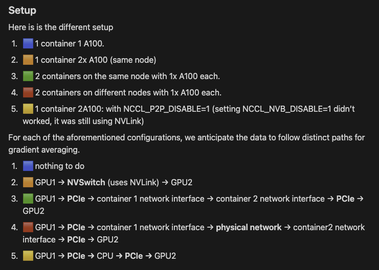
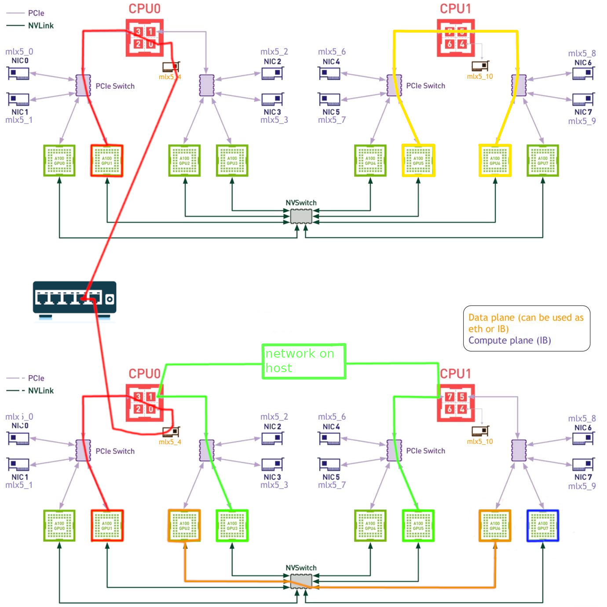

# AIchor Pytorch demo using HuggingFace Accelerate

This is a demo project for the PyTorch operator on the AIchor platform

### ⚠️ Warning:
This project it not indented to be good from the machine learning point of view. It it just intended to show how to use pytorch distributed with HuggingFace Accelerate.

## What it does

This experiments trains `TinyLlama/TinyLlama_v1.1` with the `glue/mrpc` dataset.

While training logs will be automatically pushed to the output bucket in the tensorboard format, it can be visualized from the side tensorboard:

When training finishes, the model is saved on the output bucket at `AICHOR_OUTPUT_PATH` which corresponds to `s3://<project-output-bucket>/output/<experiment-id>`

The PyTorch operator will inject environment variables needed by torchrun to setup the distribution automatically when there are more than 1 Worker.

## How to run these experiments

You can find multiple examples of manifests in the `manifests` directory with differents GPU accelerators, number and distribution design.

To test one of the examples, just copy the content to the root `manifest.yaml` file and start the experiment.

# Notes

## Quadro

Quadro and non-quadro experiment aren't really comparable since it isn't using the same model.
Also quadro GPUs does not have nvlink meaning that devices have to go thought PCIe to communicate which is slower.

The absence of nvlink justifies the lack of performance gap between experiments using 2 or 4 quadros.

## Distributed Without RDMA

When running the experiment in a multi-node way (= multiple containers) without RDMA performance won't linearly scale, for example:
- 1 container with 4 v100 (total = 4 GPUs) took 4m5s.
- 2 containers (same node) with 2 v100 each (total = 4 GPUs) took 25m11s.
- 1 container with 2 v100 (total = 2 GPUs) took 7m22s.

So adding more container slows the training. This happens because of the distribution technique which duplicates the model on each GPUs and train and then has to sync. Network intensive operations.
This sync period is the culprit:

### 1 container with multiple GPUs

Here all of the GPUs are monted on the same container and can use NVIDIA's api to communicate using nvlink:
- reaching ~20GiB/s per GPU through nvlink
- reaching ~3GiB/s per GPU through PCIe

### 2 containers with 1 GPU each on the same node

Here the GPUs cannot communicate directly using nvlink, data has to through PCIe, CPU, back to PCIe which causes a big bottleneck.
- no nvlink
- reaching ~3GiB/s per GPU through PCIe

### 2 containers with 1 GPU each on 2 different nodes

Same as before but network traffic has to go through inter node networking (with switches) which makes it even slower.
- no nvlink
- 400MiB/s to 1.3GiB/s per GPU through PCIe + network

### Diagram to help understanding these bottlenecks related to the hardware design without RDMA:

[learn more](https://www.notion.so/instadeep/Multi-Node-Training-on-the-Kao-prod-Cluster-e7aa545915104f7ba2cd0f4207f6da5a)

# Distributed with RDMA

When running network-intensive distributed training, RDMA (Remote Direct Memory Access) is recommended for inter-node GPU communication. RDMA is not required for single-container experiments, as intra-node GPU communication is efficiently handled by NVLink.

Key points:
- **RDMA Usage**: Enable RDMA only when using more than one worker (multi-node setups). For single-node experiments, NVLink will handle the GPU to GPU communciation.
- **Request RDMA device access from manifest**: Request all the network devices available on nodes. For example on Kyber, GPU nodes have 4 NIC (One per PCI Switch): `["sriov_a", "sriov_b", "sriov_c", "sriov_d"]`.
- **Performance Consideration**: NVLink is generally faster than RDMA for GPU-to-GPU communication. For optimal performance, maximize the number of GPUs per worker before scaling horizontally the number of worker containers.

Find many distributed, multi host manifest examples using the RDMA network at `hugging-face-accelerate/manifests/rdma`:

| Total number of GPUs | 1 Worker (single host) |   2 Workers |   4 Workers |
|----------------------|------------------------|-------------|-------------|
|                     1|            `1*1` 8m50s |      X      |      X      |
|                     2|            `1*2` 5m50s | `2*1` 6m40s |      X      |
|                     4|            `1*4` 2m51s | `2*2` 3m58s | `4*1` 5m57s |
|                     8|            `1*8` 1m50s | `2*4` 1m53s | `4*2` 3m45s |
|                    16|                 X      | `2*8` 1m23s | `4*4` 1m29s |
|                    32|                 X      |      X      | `4*8` 0m59s |

Reminder: Performance gains may vary depending on dataset and model size and many other parameters. This demo project focuses on showcasing PyTorch Distributed with Hugging Face Accelerate over RDMA, not on ML optimization.

Just to show how **important** RDMA network is, here's a table of the exact same experiments on the same machines, same GPUs, same paremeters, only the RDMA devices weren't requested. It means that for GPU to GPU communication between 2 workers, data goes through PCI, CPU, general purpose data network, CPU (dest machine), PCI and finally destination GPU.

| Total number of GPUs | 1 Worker (single host) |   2 Workers |   4 Workers |
|----------------------|------------------------|-------------|-------------|
|                     1|            `1*1` 8m50s |      X      |      X      |
|                     2|            `1*2` 5m50s | `2*1` 59m56s|      X      |
|                     4|            `1*4` 2m51s | `2*2` 32m38s| `4*1` 49m59s|
|                     8|            `1*8` 1m50s | `2*4` 28m06s| `4*2` 27m28s|
|                    16|                 X      | `2*8` 12m57s| `4*4` 20m29s|
|                    32|                 X      |      X      | `4*8` N/A   |

# References

The operator that manages PyTorch experiments is the Kubeflow Training operator
- [operator docs](https://www.kubeflow.org/docs/components/training/pytorch/)
- [pytorch docs](https://pytorch.org/tutorials/beginner/dist_overview.html)
- [pytorch docs about communication](https://pytorch.org/docs/stable/distributed.html)
- [hugging face accelerate docs](https://huggingface.co/docs/accelerate/index)
- [hugging face accelerate examples](https://github.com/huggingface/accelerate/tree/main/examples)