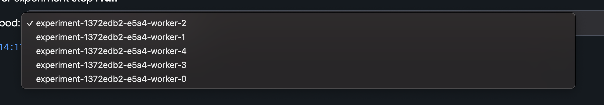
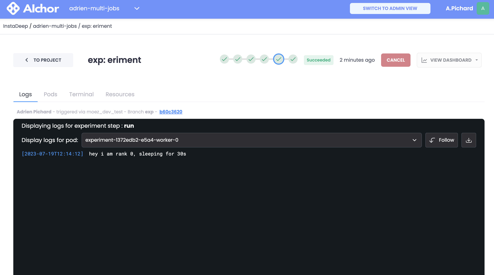
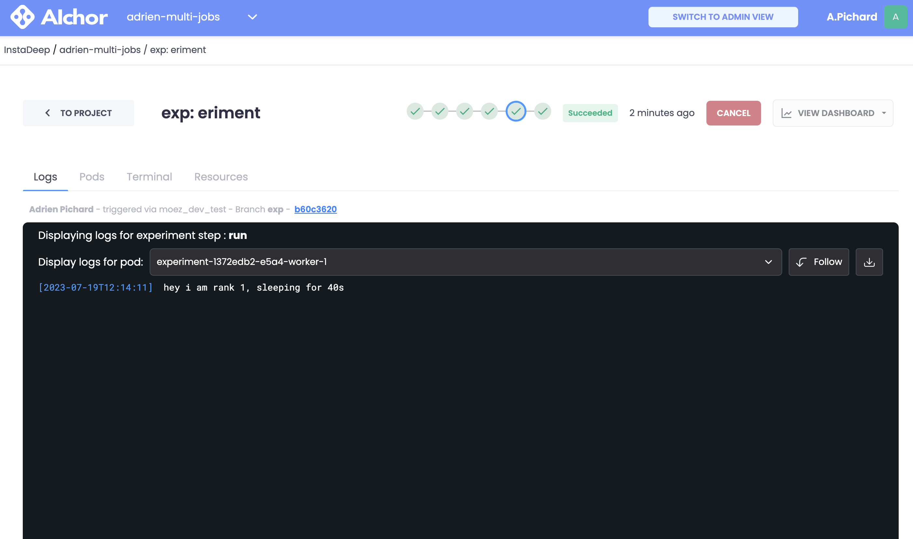
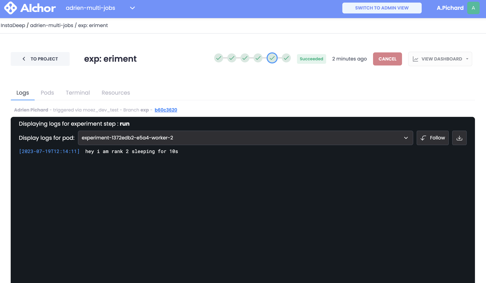
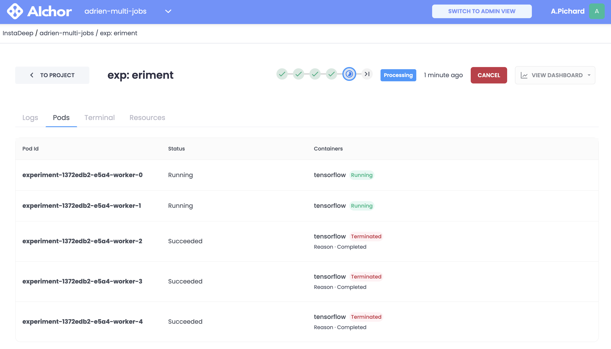

# multi-jobs-demo

This is a demo project for a multijobs experiment

## Goal

The goal of this demo project is to concurrently run multiple jobs under a single AIchor experiment.

Example:
You need to process a dataset of size 1000 with completely independent actions with 200 CPUs and 400GB of memory, that's a lot of resources for a single container, your experiment might stay `pending` forever. The solution here is to divide the workload by the number of workers:

By setting 10 workers you can set their resource request to 20 CPUs and 40GB (`ramRatio: 2`) of memory each. Next thing to do is to assign each worker the range of the dataset to work on:
```
worker 0: 1   ->  100
worker 1: 101 ->  200
worker 2: 201 ->  300
...
worker 9: 901 -> 1000
```

## How

###  First let's inspect the `manifest.yaml`

```yaml
kind: AIchorManifest
apiVersion: 0.2.1

builder:
  image: tf-multi-jobs
  dockerfile: ./Dockerfile
  context: .

spec:
  operator: tf
  image: tf-multi-jobs
  command: "python -u src/main.py"

  types:
    Worker:
      count: 5
      resources:
        cpus: 1
        ramRatio: 1
        shmSizeGB: 0
```

Requirements:
- Use the `tf` operator.
- Set multiple Worker (defined at `spec.types.Worker.count: 5`)

This manifest will create an experiment with 5 containers, each one of them will have the same resource requirements (1 CPU, 1G of memory). Each container will execute the command: `spec.command: "python -u src/main.py"`

### Inside the code

By selecting multiple workers with the tf operator, it will schedule 5 containers and will, concurrently, execute `python main.py`. Workers should read the `TF_CONFIG` environment variable to know what it their rank. This variable is injected by AIchor components.
This environment variable is in json format and the rank value is at `task.index`:
```python
def get_rank() -> int:
    tf_config_raw = os.environ.get("TF_CONFIG")
    if tf_config_raw == None:
        return 0

    tf_config = json.loads(tf_config_raw)
    return int(tf_config["task"]["index"])
```

Then when your worker is aware of its rank you can assign them different tasks:
```python
if __name__ == '__main__':
    rank = get_rank()

    if rank == 0:
        print("hey i am rank 0, sleeping for 30s")
        time.sleep(30)
    elif rank == 1:
        print("hey i am rank 1, sleeping for 40s")
        time.sleep(40)
    else:
        print(f"hey i am rank {rank} sleeping for 10s")
        time.sleep(10)
```

In this example:
- Container with rank `0` will print `hey i am rank 0, sleeping for 30s` and then sleep for 30s before exiting.
- Container with rank `1` will print `hey i am rank 1, sleeping for 40s` and then sleep for 40s before exiting.
- Container with ranks `2`, `3` and `4` will print `hey i am rank {rank} sleeping for 10s`  and then sleep for 10s before exiting.

## Limitations
For now the failure behavior is very strict, if one of the worker fails (out of memory, exit with status code different than 0, ...) , then it will fail the whole experiment and other container will be killed.

## Screenshot demo

Multiple workers running



Worker 0 output



Worker 1 output



Worker 2 output



Workers 2-3-4 complete first



Worker 0 completes

