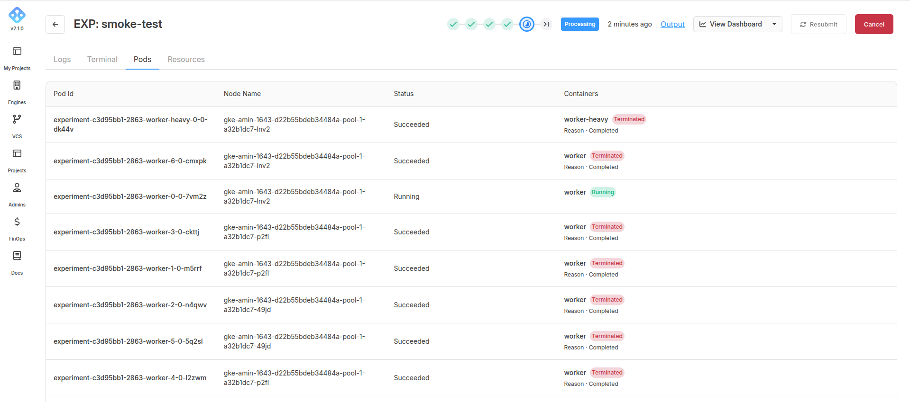
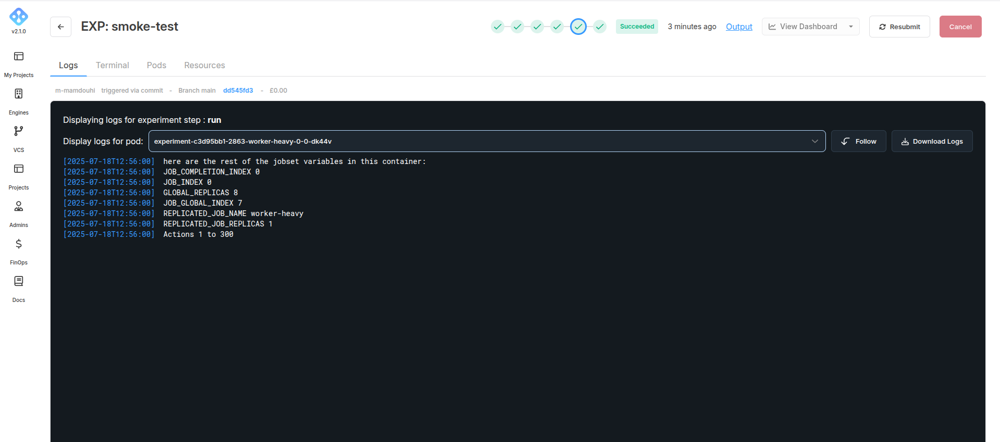

In scenario 2 you might want to distribute the actions in a more uneven way because of a specific requirement for some of the actions, for example the first 300 actions must be done together and need more CPUs because they have a heavier load, but the rest can be divided equally:

```
worker-heavy  0: 1   ->  300
worker        0: 301 ->  400
worker        1: 401 ->  500
...
worker        6: 901 -> 1000
```

For this since we need separate specifications in terms of the cpu requirements we need different types:

```yaml
kind: AIchorManifest
apiVersion: 0.2.1

builder:
  image: jobset-multi-jobs
  dockerfile: ./Dockerfile
  context: .

spec:
  operator: jobset
  image: jobset-multi-jobs
  command: "python -u src/main.wkr-heavy-1-1-1.py"

  types:
    worker-heavy:
      count: 1
      resources:
        cpus: 60
        ramRatio: 2
        shmSizeGB: 0
    worker:
      count: 7
      resources:
        cpus: 20
        ramRatio: 2
        shmSizeGB: 0
```
But in this scenario because we have two different types we cannot necessarily rely on the `JOB_GLOBAL_INDEX` variable instead we must use some of the other ones. Namely `JOB_INDEX` and `REPLICATED_JOB_NAME`

```python
import time
import os
import random

def jobsetop():
    job_completion_index = os.environ.get("JOB_COMPLETION_INDEX")
    job_index = os.environ.get("JOB_INDEX")
    global_replicas = os.environ.get("GLOBAL_REPLICAS")
    job_global_index = os.environ.get("JOB_GLOBAL_INDEX")
    replicated_job_name = os.environ.get("REPLICATED_JOB_NAME")
    replicated_job_replicas = os.environ.get("REPLICATED_JOB_REPLICAS")

    print("JOB_COMPLETION_INDEX ", job_completion_index)
    print("JOB_INDEX ", job_index)
    print("GLOBAL_REPLICAS ", global_replicas)
    print("JOB_GLOBAL_INDEX ", job_global_index)
    print("REPLICATED_JOB_NAME ", replicated_job_name)
    print("REPLICATED_JOB_REPLICAS ", replicated_job_replicas)

def get_rank() -> int:
    jobset_global_index = os.environ.get("JOB_INDEX") # here JOB_GLOBAL_INDEX can NOT be used in this scenario
    if jobset_global_index == None:
        return 0
    return jobset_global_index

def get_type() -> str:
    jobset_type = os.environ.get("REPLICATED_JOB_NAME")
    if jobset_type == None:
        return 0
    return jobset_type

# Now we can use the variables to define different tasks
if __name__ == '__main__':
    print(f"here are the rest of the jobset variables in this container:")
    jobsetop()

    type_of_job = get_type()
    rank = int(get_rank())
    if type_of_job == "worker-heavy":
      print("Actions 1 to 300")
    else:
      start = rank * 100 + 1
      end = start + 99
      print(f"Actions {start} to {end}")
      time.sleep(random.randint(10, 60))

```
Below you can see the pods in this scenario succeed



and now the logs of a few of the pods

worker-heavy-0-0:



worker-5-0:


